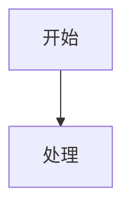

# Obsidian 的 13 种内容形式——全面摘要

> 原文链接：https://mp.weixin.qq.com/s/X_c1dgLDAtq951MipIUYWw

本文详细拆解 Obsidian 支持的 13 种内容形式，从基础语法到架构思想，并结合作者实战经验给出取舍建议与避坑指南。最后升华到对 Obsidian 四层架构的理解，强调**结构重于样式**的核心理念。

---

## 1. 属性 / Frontmatter / YAML

- 笔记开头 `---` 包裹的 YAML 区域，是笔记的**元数据层**。
- 正文回答"说了什么"，frontmatter 回答"是什么"。
- 作者常用字段：

```yaml
---
tags:
published:
author:
link:
status:
  - 🔴未开始
---
```

- **核心价值**：
  - 配合 Dataview 按标签、状态、时间筛选全库笔记。
  - `aliases` 别名：文件名不变，但通过别名全局索引，如 `aliases: [上周产品复盘]`，用 `[[上周` 即可触发补全。
- **迁移警示**：YAML 虽是纯文本，其他工具无法像 Obsidian 那样做查询和分类，但数据不会丢失，作者认为"值"。

---

## 2. 文本格式

标准 Markdown 语法：

```markdown
**粗体**
*斜体* 或 _斜体_
**_粗斜体_**
~~删除线~~
==高亮==
```

- **作者实践**：只用粗体、斜体、高亮，减少其它格式以避免导出 Word 等时的异常。
- **高级技巧**：通过主题 CSS 赋予不同格式颜色（粗体红色、斜体绿色、高亮橙色），用于区分场景。

---

## 3. 列表

三种列表代表不同的思维结构：

- **无序列表** `-`：分类、集合，不分先后。
- **有序列表** `1.`：步骤顺序，不能乱。
- **任务列表** `- [ ]`：状态跟踪，每项有完成/未完成标记。

- **作者习惯**：有序列表用得少，强调顺序时直接在正文写；无序列表更灵活。
- **核心扩展**：任务列表配合 **Tasks 插件** 或 **Dataview** 可跨文件聚合待办，变成"可查询的待办信号"。例：

```markdown
- [ ] 读完《认知觉醒》 #读书
- [ ] 整理 inbox #admin
```

---

## 4. 引用

- 标准引用块：`>`，各平台通用。
- Obsidian 扩展 **Callout**：`> [!tip]` 等，带彩色框和图标。

- **作者坚决不建议用 Callout**：它会把内容锁定在 Obsidian 生态，切换到 Typora、VS Code 等会显示源码符号，破坏可移植性。
- **原则**：坚持用标准 `>`，除非确定一辈子只用 Obsidian。

---

## 5. 代码

- 行内代码 `` `code` ``：标注名词或短术语，读者快速扫过。
- 代码块 ```` ``` ````：完整片段展示，供仔细阅读。

- **关键技巧**：
  1. **必须标注语言名**（如 ` ```python `），否则无语法高亮，灰蒙蒙一片。
  2. **展示代码块语法本身**：用四组反引号包裹，防止被渲染。

---

## 6. 数学公式

- 行内公式：`$...$`
- 块公式：`$$...$$`
- Obsidian 使用 Katex 渲染（可选 MathJax）。

- **避坑**：行内 `$` 符号会误触发，需转义 `\$` 或在后面加空格。
- **最佳实践**：短公式才用行内，稍复杂的一律使用公式块，支持 `\tag{}` 编号，适合论文式笔记。

---

## 7. 表格

GFM 标准表格，支持对齐：

```markdown
| 特性 | Obsidian | Notion |
| :--- | :---: | ---: |
| 离线 | ✅ | ❌ |
```

- 编辑体验一般，无图形化编辑，但对**并排对比**信息无替代品。
- **小技巧**：
  - 对齐符合：`:---`（左）、`:---:`（中）、`---:`（右）
  - 控制列宽：`<div style="width: 100px">列名</div>`

---

## 8. 链接（Obsidian 核心能力）

- 基础语法：
  - 外部链接：`<url>` 或 `[描述](url)`
  - 内部链接：`[[笔记名]]`、`[[笔记名|显示名]]`、`[[笔记名^块id]]`
  - 嵌入：`![[笔记名]]`、`![[笔记名#标题]]`

- **选择内链 vs 标准链接的血泪教训**：
  - 标准 Markdown 链接是硬编码路径，文件移动/改名即断。
  - Obsidian 的 `[[笔记名]]` 是**全局索引**，仅在**内部**操作重命名/移动时自动更新链接；在外部（Finder/终端）操作则失效。
  - **别名**：`[[20260709-会议纪要|上周的复盘会议]]` 既保文件名又显整洁。
  - **块引用与嵌入风险**：
    - `![[笔记名^块id]]`：`^块id` 脆弱，段落重新编辑可能导致块 ID 变更，易断。
    - `![[笔记名#标题]]`：相对稳定，但标题删除也会失效。
    - 嵌入适合**稳定不变**的内容，频繁修改的笔记用内链 `[[ ]]` 更安全。

---

## 9. 图片

- 标准 Markdown：``，路径相对脆弱。
- Obsidian 方式：`![[图片.png]]`，走附件目录，笔记移动不影响路径。
- **实际使用**：作者全部改用 `![[ ]]` 以利用全局索引。
- **控制尺寸**：
  - `![[图片.png|400]]`（宽 400px）
  - `![[图片.png|x300]]`（高 300px）
  - 支持拖拽边缘手动缩放，作者仍习惯手动加参数（如 `|600`）。

---

## 10. 脚注

脚注语法：

```markdown
机器学习[^1]在过去十年发展迅速。

[^1]: 特别是深度学习，虽然严格来说它只是机器学习的子集。↩︎
```

- **价值**：保持正文流畅，补充信息、出处、延伸阅读放脚注。
- **Obsidian 特色功能**：
  - 鼠标悬停 `[^1]` 可预览脚注内容。
  - 点击侧边栏脚注视图，可列出所有脚注并快速跳转。

**原则**：一句话说不完的补充、来源、延伸阅读全部脚注，正文只留主线。

---

## 11. 注释

- HTML 注释：`<!-- -->`，标准语法，源码中保留但渲染不显示。
- Obsidian 专属：`%% %%`，阅读模式/导出 PDF 均不显示。

- **使用场景**：
  - `%%` 用于内部笔记间给自己看的备注（如"待完善""审阅后删除"）。
  - `<!-- -->` 几乎不用，仅发布到其他平台需要保留注释指令时用。
- **坑**：切换到 VS Code 或 Typora 时，`%%` 内容会暴露，建议多工具使用者统一用 HTML 注释。

---

## 12. Mermaid



- 原生支持流程图、时序图等，但体验缺陷：中文常乱码，复杂图布局不可控。
- **适用场景归纳**（仅对简单、逻辑固定的情况）：
  - 简单流程（不超过 5 个节点）
  - 不追求精确布局
  - 需文本化版本控制
- **替代方案**：复杂图用 Excalidraw 画完截图粘贴，牺牲可编辑性但保证可读性。

---

## 13. HTML

可在 Markdown 中直接写 `<div>`、`<span>`、`<iframe>` 等，但**强烈不推荐**。

- 破坏纯文本可读性，源码模式下难以维护。
- **唯一使用场景**：
  - `<center>` 居中内容
  - `<span style="color: ...">` 临时颜色强调
  - `<details><summary>` 折叠块（隐藏冗长内容）
- **作者原则**：一旦开始写 HTML，就放弃了可移植性，其他编辑器大概率渲染异常。

---

## 扩展与补充

- 以上第 4、8、9、11 部分中，Callout、Wikilink、嵌入、块引用、标签、Frontmatter 等均非标准 Markdown，属于 Obsidian 扩展，解决的是**多篇文章如何组织**的问题。
- 非文本内容形式（后续展开）：
  - Canvas：可视化卡片布局，头脑风暴
  - Excalidraw：手绘风格，架构图
  - 手写 Ink：数学推导和批注

---

## 重新理解 Obsidian：四层架构与知识组织哲学

### 为什么是 Markdown？
知识依赖**结构**而非样式。一本书去掉颜色字体仍清晰，Markdown 保存的就是层级、并列、顺序、引用等结构。

### 为什么只有十几种语法？
人类表达信息的关系本质只有几种：层级、并列、顺序、引用、关联。Markdown 将其符号化。

### Obsidian 真正增加的是什么？
- **标准 Markdown**：组织一篇文章。
- **Obsidian 扩展**（双向链接、Frontmatter、Dataview 等）：组织无数篇文章，构建知识网络。
- `[[牛顿]]` 不是超链接，而是建立笔记间的关联。
- Frontmatter 分离元数据与正文，使笔记成为可管理的数据对象。

### Obsidian 的四层架构
1. **Markdown**：建造每栋房子（单篇笔记）。
2. **双向链接**：修建道路，连接房子。
3. **Frontmatter**：建立房屋档案（元数据）。
4. **Dataview、Canvas、Bases、图谱**：管理、查询、可视化整座城市。

**核心思想**：知识的价值取决于结构是否清晰、关系是否明确、数据是否可管理。
学会用"结构"思考笔记，才是长期积累的关键。
